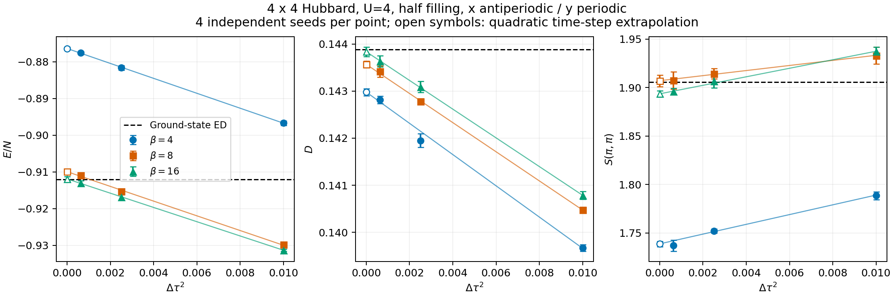

# 4x4 AP/P Hubbard comparison with ground-state ED

This dataset uses the merged directional-boundary implementation at commit
`4384c37c1b9740016bdeea1bdd8f6b48078b051e`. The executable is the already-tested
binary with SHA-256 `d685f060cc9e1f88547868b5fabeeda0245c284c5a218923d6d6e3d52ed5ce4f`;
the source tree is identical to the directional-boundary validation tree.

## Conditions and scope

- Square 4x4 (16 sites), x antiperiodic, y periodic, hopping `t=-1`, `U=4`,
  half filling, chemical potential `mu=2`.
- `beta=4,8,16`; `dtau=0.1,0.05,0.025`; four distinct independent seeds per
  point: 36 runs. Seeds and inputs were fixed before starting the batch in
  [registration.json](registration.json).
- Per run: 5000 warmup sweeps, 20000 measured sweeps, 20 bins of 1000 sweeps,
  `stab=4`, serial, `green_rebuild=combine`, no tempering or global updates,
  ordinary estimators (`conditional_measure=0`), all spin momenta.
- At most four concurrent processes, each at nice 10 with one BLAS thread.

QMC is finite-temperature grand canonical; ED is canonical at zero temperature,
with eight up and eight down electrons. The mean density being one does not
make these ensembles identical. This is an exploratory comparison, not a
pre-registered physics acceptance test or a proof of a zero-temperature plateau.
The QMC source implementation was not changed for this calculation.

## Reference conventions

[ed_source_summary.json](ed_source_summary.json) preserves the numerical summary
of a completed HΦ 3.5.2 CG/LOBPCG run from 2026-08-14.
[ed_stan.in](ed_stan.in) specifies the lattice, interaction, particle sector,
and boundary phases. [ed_reference.json](ed_reference.json) binds their checksums
and retains the archived raw-artifact hashes. ED was not rerun here; the full
eigenvector and raw correlation files are not bundled. The reported residual
norm is `1.40432e-6`; it is not an independently derived observable error bound.

Energy is `E_hub/N = <K + U sum n_up n_down>/N`, excluding `-mu*N`.
Double occupancy is per site. The spin convention is
`S(q) = (1/N) sum_ij exp[-iq.(ri-rj)] <S_i . S_j>`; QMC uses the paired
`Szz(q)+Sperp(q)` estimate. The singlet ED components are `Szz=S/3` and
`Sperp=2S/3`. Momentum `Q=(pi,pi)` has integer indices `(2,2)` even with AP/P
fermionic boundary conditions. No extra division by 16 is applied to `S(Q)`.

## Analysis

The point estimate is the equally weighted mean of four independent seed
means. Its standard error is their sample standard deviation divided by two.
The three time steps are fitted to `a + b*dtau^2` with inverse-variance weights;
fit errors use the supplied SE without rescaling by chi-square. Four seeds give
an imprecise variance estimate, so reported z ratios and chi-square p values are
nominal diagnostics, not calibrated significance guarantees.

All seed/bin observations are retained. Paired spin sums and differences preserve
covariance. The analysis also reports bin regrouping at 1000/2000/4000/5000
sweeps, measurement second-half minus first-half differences, all-q SU(2)
differences, beta=16 minus beta=8, and a two-point extrapolation using only
dtau=0.05/0.025. These diagnostics are not used to select favorable data.

## Results and interpretation

All 36 runs completed with exit 0 in 554.3 seconds elapsed. All 720 bins
(720000 measurements) passed input/output hash, signed-hopping, sign=1,
half-filling, spin sum-rule and scalar/spin/bin consistency checks.

Energy and double occupancy at beta=16, after time-step extrapolation, agree
with the ED reference. **Spin agreement remains unresolved**: the direct
Szz+Sperp estimate is 3.72 nominal SE below ED, the transverse component is
4.21 SE low, and extrapolated paired SU(2) differs from zero by 3.17 SE.
This result does not establish complete 4x4 AP/P physics validation.

| Observable | beta=16, dtau → 0 (mean ± SE) | Ground-state ED | Difference / SE |
| --- | ---: | ---: | ---: |
| E/N | -0.91192267 ± 0.00059126 | -0.9120936826 | +0.29 |
| D/site | 0.14383561 ± 0.00009996 | 0.1438872045 | -0.52 |
| Szz(Q) | 0.63817057 ± 0.00213753 | 0.6351713762 | +1.40 |
| Sperp(Q) | 1.25605597 ± 0.00339357 | 1.2703427524 | -4.21 |
| S(Q) | 1.89350932 ± 0.00322351 | 1.9055141287 | -3.72 |
| Sperp(Q) - 2 Szz(Q) | -0.02125688 ± 0.00671054 | 0.0000000000 | -3.17 |

The three-point fit p values for E/N, D and S(Q) at beta=16 are 0.814, 0.858,
and 0.738. A satisfactory fit does not establish equilibration. The two fine
steps give E/N=-0.9117473 ± 0.0009509, D=0.1438125 ± 0.0001633, and
S(Q)=1.8923029 ± 0.0048344 (2.73 nominal SE below ED). The spin conclusion
is not strengthened by dropping the coarse point; no data were dropped from
the primary result.

Temperature extrapolations of E/N are -0.8764087 ± 0.0003970 at beta=4,
-0.9099494 ± 0.0004778 at beta=8, and -0.9119227 ± 0.0005913 at beta=16.
Beta=8 still differs from ground-state ED; a beta=8/16 plateau is not established.

For paired SU(2) at Q, individual finite-step estimates have maximum |z|=2.46.
Across all 144 (beta,dtau,q) entries, 15 exceed nominal |z|=3, with maximum
21.76 at beta=16, dtau=0.1, q=(pi/2,pi) and its symmetry partner. These
entries are correlated, and four-seed variances can be underestimated; the
maximum must not be interpreted as a calibrated 21-sigma normal-tail probability.
It nevertheless prevents claiming that all-q spin consistency is established.
At beta=16, dtau=0.025, second-half minus first-half S(Q) is
0.0083878 ± 0.0025523 (3.29 nominal SE). Bin regrouping and seed SE also differ,
for example S(Q) at that point has seed SE=0.00319 versus 1000-sweep pooled-bin
SE=0.00643. Longer equilibration/measurement and more independent seeds are
needed to distinguish uncertainty-estimation fluctuations, sampling bias and
other causes; this calculation alone does not identify an implementation bug.

The minimum nominal fit p over all 21 fits is 0.00741 for Szz(q=0) at beta=16.
All fits and diagnostics, including these unfavorable outcomes, are retained.




## Files and reproduction

- `runs/`: all inputs, stdout/stderr, raw bins, spin/scalar files, actual
  hopping matrices, start bindings and completion records.
- `group_estimates.tsv`, `seed_estimates.tsv`: means and statistical errors.
- `dtau_extrapolated.tsv`, `fine_two_point.tsv`: time-step extrapolations.
- `temperature_comparison.tsv`, `half_run_drift.tsv`, `spin_su2_all_q.tsv`:
  convergence and spin diagnostics.
- `analysis.json`, `analysis.log`, `run_summary.json`, `driver.log`:
  validation and execution summaries.
- `comparison.png`, `comparison.svg`: scientific comparison figure.

From this directory, Python 3.10+ without extra packages reproduces the numerical
analysis; plotting additionally uses Matplotlib:

```sh
shasum -a 256 -c SHA256SUMS
python3 analyze.py
python3 plot.py
```

The analysis verifies every input, completion hash, raw output, bin sequence,
sign, density, spin sum rule, and hopping matrix. Plot file bytes can depend on
the Matplotlib version. To repeat the simulations, place `run_comparison.py` in
a new empty dataset directory two levels below the repository root, build
`dqmc`, and run `prepare` then `run`; existing runs are deliberately not
overwritten. A different executable is a new calculation and must retain its
own binary checksum and provenance.
