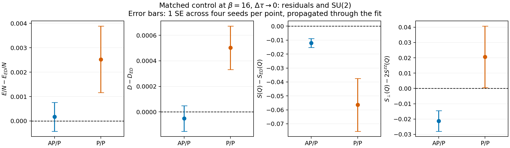
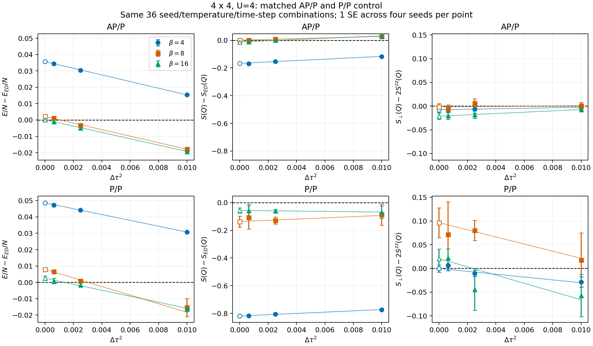

# Matched P/P control: 4x4, U=4

This control changes only `bc_x=antiperiodic` to `bc_x=periodic` relative to
the [AP/P dataset](../antiperiodic_4x4_U4_ed/README.md). Both use a square 4x4
lattice, U=4, hopping t=-1, mu=2, beta=4/8/16, dtau=0.1/0.05/0.025 and
four independent seeds per parameter. Every seed matches the corresponding
AP/P run. Each run has 5000 warmup sweeps, 20000 measured sweeps and 20 bins.
The source commit is `4384c37c1b9740016bdeea1bdd8f6b48078b051e` and the shared
executable SHA-256 is
`d685f060cc9e1f88547868b5fabeeda0245c284c5a218923d6d6e3d52ed5ce4f`.

Other settings match exactly: `stab=4`, `green_rebuild=combine`, serial,
random initial field, forward sweep order, ordinary estimators, no tempering
or global updates, and both spin channels at all momenta. Four nice-10
processes run concurrently with one BLAS thread each. The periodic output
metadata uses the equivalent legacy label `pbc=1`.

## Scope and statistics

This is a bounded exploratory control, not a formal acceptance test.
The AP/P observations, analysis and 382-file checksum manifest are preserved
unchanged. [registration.json](registration.json) binds that manifest and
fixes all P/P inputs before execution. There are no retries, excluded seeds
or changes of conditions chosen to improve ED agreement.

Each boundary is compared to its own archived HΦ 3.5.2 canonical ground-state
ED reference. The P/P source summary and input are bundled, with hashes in
[ed_reference.json](ed_reference.json). ED was not rerun; its raw eigenvector
and correlations are not bundled. The residual norm is not an observable
error bound. Finite-temperature grand-canonical QMC is distinct from this
canonical, zero-temperature reference even when the mean density is one.

The primary point estimate and SE are the mean of four independent seed
means and their sample standard deviation divided by two. Three-point
time-step fits use `a+b*dtau^2` and absolute SE, without chi-square rescaling.
The analysis retains the same paired-spin convention as AP/P:
`S(Q)=Szz(Q)+Sperp(Q)` and `Delta_SU2=Sperp(Q)-2*Szz(Q)`, with Q=(pi,pi).
S has `1/N` normalization, energy excludes `-mu*N`, and D is per site.

Identical seeds may correlate the two boundaries. Between-boundary
differences therefore use the four **matched differences** and their SE,
including that covariance. `paired_residual_extrapolated.tsv` fits
`(AP/P - ED_AP/P) - (P/P - ED_P/P)` at each beta, using the SE of the paired
difference. Its weights differ from separate fits, so it is not necessarily
identical to subtracting the two independently weighted intercepts.

`error_method_comparison.tsv` also repeats the fits using pooled bins grouped
over 1000, 2000, 4000 and 5000 sweeps, for **both** boundaries. These are
sensitivity diagnostics, not a replacement of the primary method selected
after viewing results. Four-seed SE, nominal z ratios and chi-square p values
have substantial uncertainty; the all-q diagnostics are also correlated.

## Results

All 36 P/P runs completed with exit 0 in 607.4 seconds. All 720 bins pass
integrity checks, including sign=1, half filling, independently generated
P/P hopping, scalar/spin/bin consistency and spin sum rules. The 36 matched
input pairs differ only in bc_x, and the AP/P 382-file snapshot is unchanged.

At beta=16, after the three-step extrapolation:

| Observable | AP/P QMC ± SE | AP/P ED | P/P QMC ± SE | P/P ED |
| --- | ---: | ---: | ---: | ---: |
| E/N | -0.9119227 ± 0.0005913 | -0.9120937 | -0.8488410 ± 0.0013578 | -0.8513659 |
| D/site | 0.1438356 ± 0.0001000 | 0.1438872 | 0.1156274 ± 0.0001693 | 0.1151256 |
| S(Q) | 1.8935093 ± 0.0032235 | 1.9055141 | 2.6792317 ± 0.0189227 | 2.7356497 |
| Sperp(Q) - 2 Szz(Q) | -0.0212569 ± 0.0067105 | 0.0000000 | 0.0206180 ± 0.0200456 | 0.0000000 |

The ED differences in nominal SE units are:

| Observable | AP/P | P/P |
| --- | ---: | ---: |
| E/N | +0.29 | +1.86 |
| D/site | -0.52 | +2.96 |
| S(Q) | -3.72 | -2.98 |
| Delta_SU2 | -3.17 | +1.03 |

P/P also has a spin deficit relative to its own ED: approximately 2.06%,
compared with 0.63% for AP/P. Its S(Q) SE is about 5.9 times larger, so ranking
the boundaries using the reported z ratio alone would be misleading.
P/P at beta=8 has extrapolated Delta_SU2=0.09657±0.03129 (3.09 nominal SE).
Finite-step Q SU(2) has maximum |z|=3.78 for P/P versus 2.46 for AP/P.
Thus deviations under this short, four-seed protocol are not exclusive to AP/P.

This control does **not** prove equality of the boundary-specific biases:
matched-seed extrapolation gives an AP/P-minus-P/P SU(2) difference of
-0.045578±0.014310 (3.19 nominal SE). The ED-adjusted differences are
-0.0025864±0.0012298 for E/N (-2.10 SE), -0.0005059±0.0001509 for D
(-3.35 SE), and +0.046694±0.022023 for S(Q) (+2.12 SE). These estimates use
the covariance of matched seed means and their own fit weights; they are
not simple differences of the separately weighted intercepts above.

P/P also retains Szz(q=0)=0.007792±0.000661 at beta=16, versus approximately
zero for the AP/P estimate. Its beta=8 to 16 changes and nonzero uniform-spin
signal mean that a ground-state plateau is not established by this study.
Ground-state ED residuals can therefore include remaining thermal effects
as well as statistical/sampling errors. The SU(2) identity itself holds at
finite temperature and finite time step for both models, so its deviations
cannot be attributed merely to the different ground-state ED values.

## Statistical sensitivity and remaining limits

The primary four-seed SE analysis is preserved. With 1000-sweep pooled-bin
SE used as a sensitivity check, the beta=16 S(Q) discrepancies become
-2.00 nominal SE for AP/P and -2.17 for P/P; with 4000-sweep regrouping they
are -2.09 and -2.13. This is evidence that the apparent significance is
sensitive to uncertainty estimation, not an alternative pass criterion.
The corresponding SU(2) values also depend on fit weights: the P/P pooled-bin
fit is -0.00064±0.04101, compared with the primary +0.02062±0.02005.

All-q SU(2) has 15/144 nominal |z|>3 entries for AP/P and 10/144 for P/P.
The maxima are 21.76 and 5.28, respectively. These are correlated tests with
no multiplicity correction and variances estimated from four seed means;
normal-tail significance interpretations are not justified. Half-run drift
flags occur in both boundaries (P/P maximum |z|=4.19). All values remain in
the accompanying tables. The smallest nominal three-point fit p for P/P is
0.0819; acceptable time-step fits alone do not establish equilibrium.

**Assessment:** the results do not establish a large error unique to the
antiperiodic-boundary implementation. Both boundaries show limitations of
this short comparison, while some boundary differences remain unresolved.
The calculation also does not establish complete spin convergence or rule
out a shared implementation issue. More sampling would be needed to make
stronger claims. No simulation was extended or observation removed to
improve agreement, and no QMC C source was changed.






## Reproduction and retained outputs

From this directory, using Python 3.10+ (Matplotlib only for plotting):

```sh
shasum -a 256 -c SHA256SUMS
python3 analyze.py
python3 compare_boundaries.py
python3 plot_control.py
```

`runs/` retains every input, scalar/spin file, bin sum, hopping matrix,
stdout/stderr and start/completion binding. `analyze.py` audits all 36 P/P
runs; `compare_boundaries.py` also verifies the frozen AP/P manifest and
that the input difference is exactly the boundary setting.

The main numerical files are `dtau_extrapolated.tsv`,
`boundary_differences.tsv`, `paired_residual_extrapolated.tsv`,
`error_method_comparison.tsv` and `control_comparison.json`.
`group_estimates.tsv`, `seed_estimates.tsv`, `fine_two_point.tsv`,
`temperature_comparison.tsv`, `half_run_drift.tsv` and `spin_su2_all_q.tsv`
preserve all intermediate diagnostics. `driver.log` and `run_summary.json`
record execution. Plot bytes can vary between Matplotlib versions.

To repeat the simulations, use the same source revision and copy
`run_comparison.py` into a new empty dataset directory under `data/`, with
the frozen AP/P dataset still available as its sibling. Build `dqmc`, then
run `python3 run_comparison.py prepare` followed by `python3 run_comparison.py run`.
The driver refuses to overwrite previously started runs and records the
actual executable hash. A rebuilt executable is a new run artifact and must
retain its own provenance.
